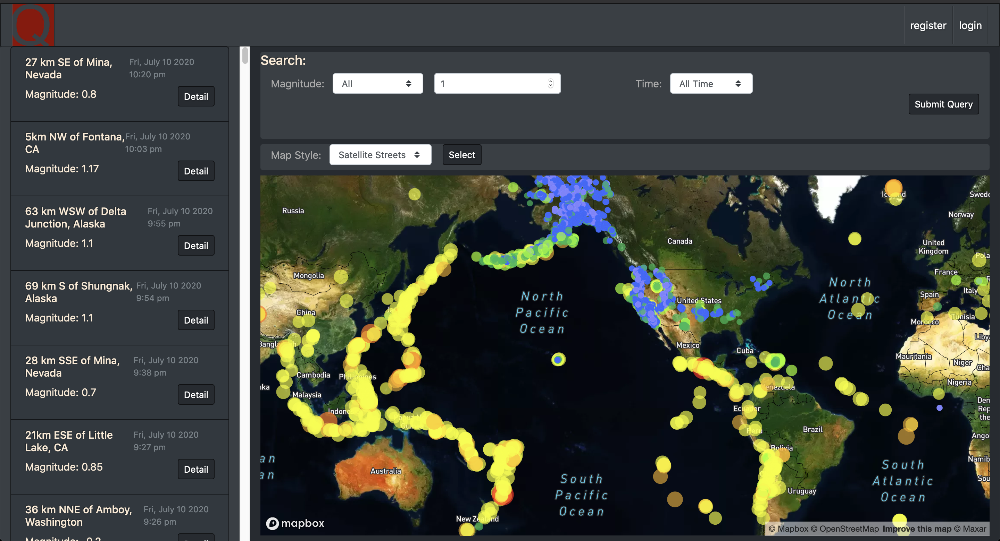
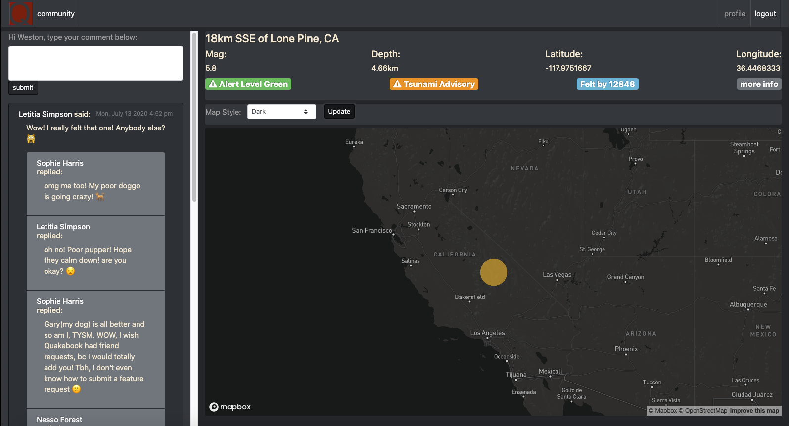

# Project 2 -- *Quakebook*

## Overview

*Quakebook* is the world's leading social media network with a community centered around seismic activity data.

*Quakebook*'s server collects data from the usgs earthquake API as seismic activity occurs, gives users access to the data in a searchable database, and displays an interactive map of of earthquakes for users to explore. Users can explore the details of a particular earthquake after selecting it from the results of their search.

*Quakebook* users can further engage with the *Quakebook community* by creating a free profile that will allow them to interact with other users by commenting on a particular earthquake or replying to other users comments. Users can edit and delete their comments and replies, view all their comments on their profile and explore the *Quakebook Community* by viewing the profiles of other users. Users may upload a profile pic at the time of account creation, and create a bio that can be updated later.

link to the project deployment:

[Quakebook](https://quakebookapp.herokuapp.com/)

## *Quakebook* homepage



## *Quakebook* earthquake details page



## MVP

[x] Create a database of seismic activity updated from the usgs earthquake catalogue API as earthquakes occur in real time.

[x] Plot seismic events on an interactive map using the mapbox api.

[x] display seismic event detail page with just one event on it

[x] allow users to securely login and comment on seismic events. 

[x] allow users to search and filter results of displayed seismic events. (~~location~~, date, magnitude, etc)

[x] all registered users viewable from users page 

[x] Users have a detail profile page with bio, pfp and comments they have made 

[x] Map is usable when not logged in, but comments and users are hidden until login

[x] styled with bootstrap 4

## Stretch

[x] users can reply to comments

~~[] users can save seismic events without commenting them~~

[x] users can edit/delete comments

[x] users can edit/~~delete profile~~

[x] additional ways to display data on map (ie ~~heatmap~~, map style selection)

~~[] make it a twitter bot that tweets out new earthquakes~~

~~[] password/account recovery~~

## Routes

HTTP Verb | Route | Request | Response | Auth Required
----------|-------|---------|----------|--------------|
GET | / | route hit | render map view/default search | no
GET | /data | data query | send data geoJSON | no
GET | /details/:earthquakeIndex | request params | render details | no
||||
GET | /auth/login | route hit | render login | no
POST | /auth/login | request body | validate render profile | no
GET | /auth/register | route hit | render register | no
POST | /auth/register | request body | create new user render profile | no
||||
GET | /users | route hit | render users | yes
GET | /users/:userId | request params | render user | yes
PUT | /users/:userId/edit | request params | edit user's bio redirect to user | yes
POST | /details/:earthquakeIndex/comment | request params request body | create new comment redirect /details/:earthquakeIndex | yes
PUT | /details/:earthquakeIndex/comment/edit | request params request body | edit comment redirect /details/:earthquakeIndex | yes
DELETE | /details/:earthquakeIndex/comment/delete | request params request body | delete comment and replies redirect /details/:earthquakeIndex | yes
POST | /details/:earthquakeIndex/comment/:commentIndex/reply | request params request body | create new reply to a comment redirect /details/:earthquakeIndex | yes
PUT | /details/:earthquakeIndex/comment/:commentIndex/reply/:replyIndex/edit | request params request body | edit reply to a comment redirect /details/:earthquakeIndex | yes
DELETE | /details/:earthquakeIndex/comment/:commentIndex/reply:replyIndex/delete  | request params request body | delete reply to a comment redirect /details/:earthquakeIndex | yes

### APIs used

> * [usgs earthquake catalogue](https://earthquake.usgs.gov/fdsnws/event/1/)
> * [mapbox](https://www.mapbox.com/)
> * [axois client api](https://unpkg.com/axios/dist/axios.min.js)
> * [cloudinary](https://cloudinary.com/)
> * [randomuser.me](https://randomuser.me/)

## Database models

[Database Models](https://drive.google.com/file/d/1Sro1wSSi3B4oBOXUqYn4Z_SLfWl59hPU/view)

## Wireframes 

the map search page and map detail page where significantly redesigned

[Wireframes](https://app.diagrams.net/?libs=general;mockups#G1up9xol3OMxxRLe34gjBcLpUwVfqxfurd)

## Trello

[trello board](https://trello.com/b/zcVCIB7s/p2)

## Daily goals plan on hack md


[hackmd](https://hackmd.io/cgyQCz0oT0SvSjGNwih8YA)

## Technical details

### pseudo code for various aspects of the project

#### Maintaining an updated database of earthquakes

the usgs api will be queried every second or so to check if there are any new earthquakes, and the database will be updated accordingly. In the actual project this portion of the code (found in `./private/toolbox.js`) also updates the database if the usgs flags an earthquake as updated. 

```javascript
const axios = require('axios');

let timeoutUsgsQuery;

function getData(){
  axios.get("https://earthquake.usgs.gov/earthquakes/feed/v1.0/summary/2.5_hour.geojson")
    .then(function (response) {
      //check database for 
      for(feature in response.data){
        db.earthquake.findOrCreate({
          //check usgs's id against database
          where: {
            usgsId: feature.properties.id
          },
          //defualt values if not found (only matter if not found)
          defaults: {
            //update accordingly
          }
        })
        .then( ([earthquake, created]) => {
          //check if any data has been updated if not created
          if(!created){
            //check feature.properties.status for update
          }
        })
        .catch( error => {
          // handle error from database
          console.log(error);
        });
      }
    })
    .catch(function (error) {
      // handle error from axios
      console.log(error);
    })
    .finally(function () {
      //callback a another query
      timeoutUsgsQuery = setTimeout(getData, 1000);
    });
}

getData();


```

#### Mapbox client side javascript

Mapbox needs be configured from client side javascript. Getting complex data from from the server to client using ejs template rendering was a hurdle for this project. 

After trying various methods such as strinigifying JSONs from the server and creating objects of search values on the server, I decided I preferred to pass simple values as search terms (strings, integers) from the server to the client when rendering pages. The client then makes a fetch request (with axios client api) back to the server when DOM content is loaded to get large payloads of geoJSON data for mapbox to use. 

I preferred this method because the DOM load times with large string JSONs sent from the server where way too long. Making search objects to pass to client js had to be used in `<script>` tags in ejs templates, since DOM datasets only allow for 150 characters or so per value. My solution was to break searches into smaller variables to use in a client js file. I wanted to avoid working in `<script>` tags, because that can make troubleshooting difficult during development.

##### ejs pseudo code to pass searches to client js:

```html
<!-- ejs passing search terms/mapbox info to client js with -->

<!-- search terms for mapbox -->
<% var longitude = //desired center latitude; %>
<% var latitude = //desired center longitude; %>
<!-- api access key -->
<% var mapKey = //unique api access key; %>

<!-- id of desired earthquake from database, more complex search params can be made with more variables -->
<% var earthquakeId = earthquakeId; %>

<!-- load up a div with data attributes -->
<div id="dataDiv" 
data-longitude=<%= longitude %> 
data-latitude=<%= latitude %> 
data-mapKey=<%= mapKey %> 
data-earthquakeId=<%= earthquakeId %> >
</div>

<!-- include axios client api -->
<script src="https://unpkg.com/axios/dist/axios.min.js"></script>

<!-- inlcude client js -->
<script src="/js/map.js"></script>
```

##### client js to fetch data and render map:

```javascript
//make a variable with the data from the dom
//keys in the dataset are NOT camelcase
let data = document.getElementById('dataDiv').dataset;

//render map
  mapboxgl.accessToken = data.mapkey;
  var map = new mapboxgl.Map({
    container: 'map',
    // style: 'mapbox://styles/mapbox/streets-v11',
    style: 'mapbox://styles/mapbox/satellite-v9',
    center: [data.latitude, data.longitude],
    zoom: 5
  });

//fetch data from /data route on server
  let geojson;
  axios({
    method: 'get',
    url: '/data',
    params: {
      search: data.earthquakeid //search terms would go here
    }
  })
  .then( response => {
    //make an array of the features sent from server
    geojson = Object.entries(response.data.features);

    //interate over array of features and create mapobox marker elements
    geojson.forEach( (marker, index) => {
      //convert milliseconds tp current date
      let time = new Date(marker[1].properties.time);

      //configure DOM for mapbox elements
      let el = document.createElement('img');
      el.class = 'marker';
      el.src = './images/mapbox-icon.png';
      el.style.width = '2vw';
      
      //configue mabox pop up variable
      let popup = new mapboxgl.Popup({ offset: 25 }).setText(
        `${index} ${marker[1].properties.place} \n
        magnitude: ${marker[1].properties.mag} \n
        time: ${time} \n`
      );

      //create new mapbox marker
      new mapboxgl.Marker(el)
      .setLngLat(marker[1].geometry.coordinates)
      .setPopup(popup)
      .addTo(map);
    })
  })

```

##### server js at the /data route

```javascript
//server js route for data retrieval in /data
router.get('/data', (req, res) => {
  //do some kind of test on incoming query
  if(req.query.search){
    //parse data from string to array
    let indexArray = req.query.search.split(',');
    //data object in geoJSON foormat to send back
    let responseObject = {
      type: "FeatureCollection",
      title: "Quakebook requested earthquakes"
      features: []
    };

    //itarate over array of requested ids
    indexArray.forEach(id => {
      //look up id in databse
      db.user.findOne({
        where: {
          id: id
        }
      })
      .then(foundFeature => {
        //push feature to response
        responseObject.features.push(foundFeature)
      })
      .catch( error => {
        //handle database errors
        errorHandler(error);
      })
      .finally( () => {
        //send response object back once database operations are complete
        res.send(responseObject);
      });
    });
  }
});

```

## Sources

### Mapbox:

> * https://docs.mapbox.com/mapbox-gl-js/api/
> * https://docs.mapbox.com/mapbox-gl-js/example/setstyle/
> * https://docs.mapbox.com/help/tutorials/#unity
> * https://docs.mapbox.com/mapbox-gl-js/example/heatmap-layer/ (sadly, unused)
> * http://plnkr.co/edit/qjIAiud3aUF11iQPDKj0?p=preview&preview (!important)
```css
/*  (from above source) to get the map to behave with dimensions relative to other elements, 
it has to inherit size from a parent div, 
otherwise the mapbox needs a position of absolute. 
This method lets the map be put in bootsrap columns ect. */

/* container for map, cotrols actual map dimensions */
#map-container {
  position: relative;
  height: 100%;
  width: 100%;
}

/* mapbox div */
#map {
  position: relative;
  height: inherit; 
  width: inherit;
}
```
```html
<div id="map-container">
    <div id='map'>
    </div>
</div>
```


### Bootstrap:

> * https://www.tutorialrepublic.com/twitter-bootstrap-tutorial/
> * https://www.bootstrapcdn.com/bootswatch/
> * https://www.w3schools.com/bootstrap4/bootstrap_flex.asp
> * https://www.codeply.com/go/jbcgzs2Nzq
> * https://gijgo.com/ (unused in final deliverable -- but the code for a popout date picker is in place for the future)
> * https://gijgo.com/datepicker/example/bootstrap-4
> *  https://www.tiny.cloud/blog/bootstrap-wysiwyg-editor/ (unused)

### Express:

> * https://www.hacksparrow.com/webdev/express/custom-error-pages-404-and-500.html (unused)
> * https://expressjs.com/en/guide/writing-middleware.html
> * https://www.tutorialspoint.com/expressjs/expressjs_cookies.htm (unused)


 ### text emojis for fun console logs:

 > * [└[∵┌]└[ ∵ ]┘[┐∵]┘](https://gist.github.com/jordanorelli/11229304)
